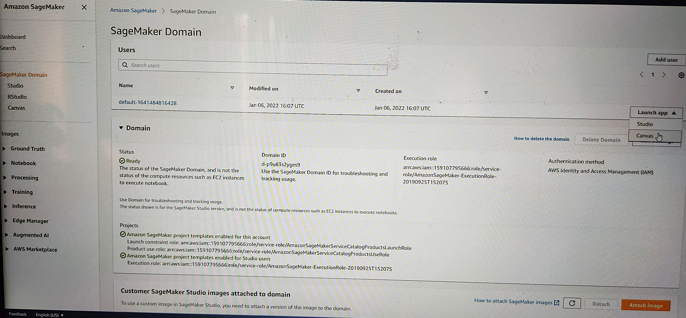
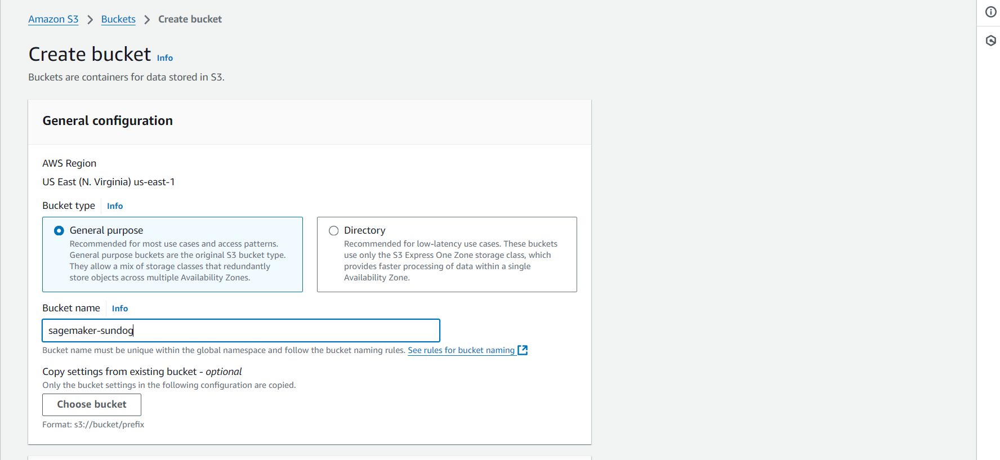
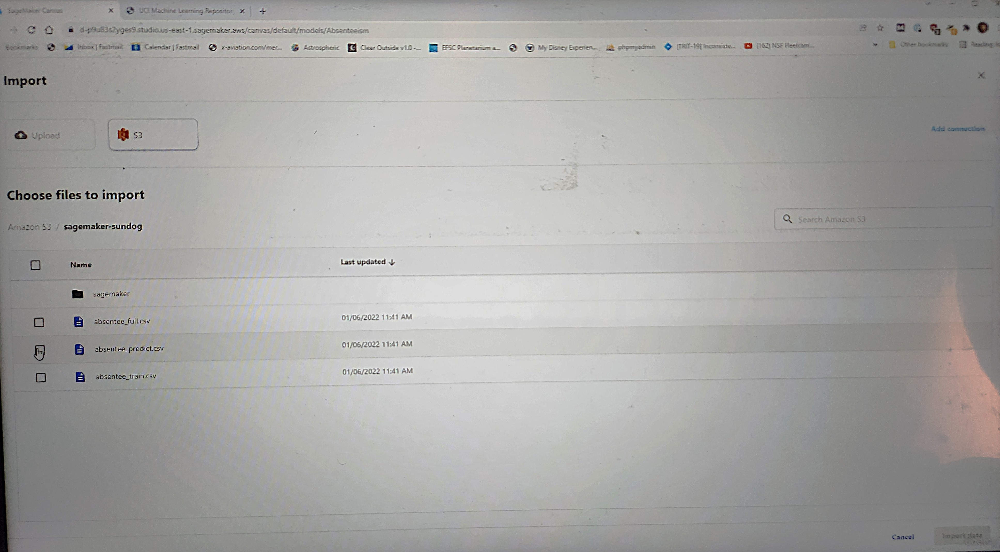
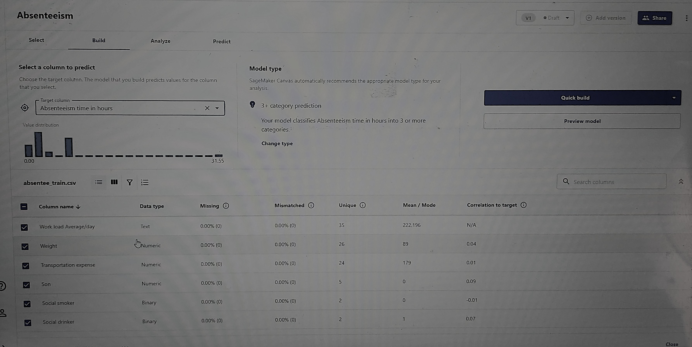
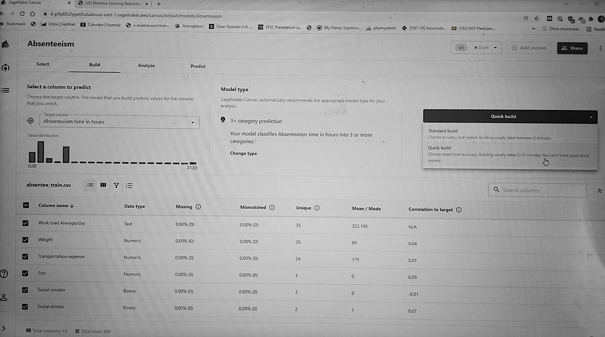
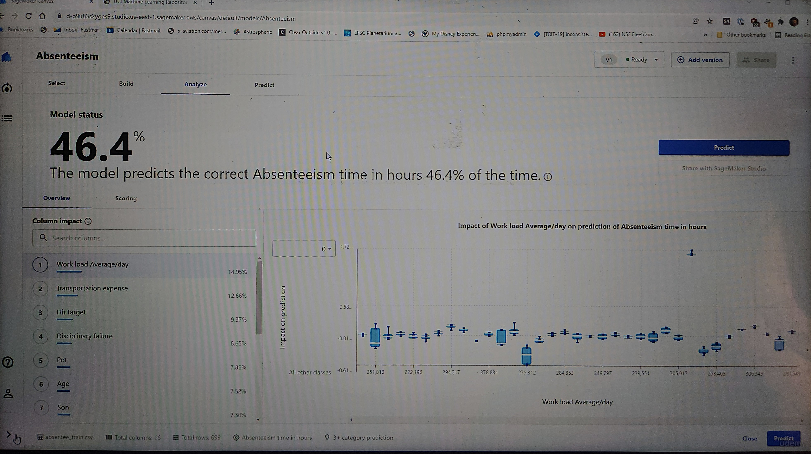
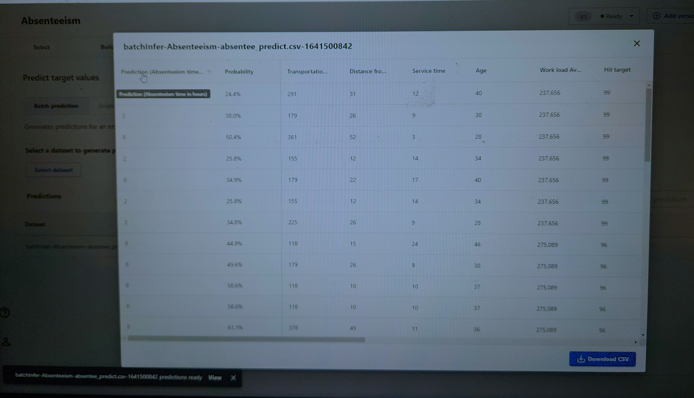

<h1>Employee Absenteeism Prediction Using AWS SageMaker Canvas</h1>

<h2>Description</h2>
This project aims to develop a machine learning model to predict employee absenteeism based on various factors such as workload, transportation expenses, disciplinary history, and personal attributes. Using AWS SageMaker Canvas, a no-code, visual interface for building machine learning models, this project enables HR departments to gain insights into factors contributing to employee absenteeism. By predicting absenteeism, companies can make informed decisions to optimize workforce planning and reduce potential productivity losses.
<h2>Objectives:</h2>
- <b>Build a Predictive Model: Use historical data to predict the number of hours an employee is likely to be absent on a given day.</b>
- <b>Identify Key Factors: Analyze the impact of different features such as workload, age, disciplinary actions, transportation expenses, and personal characteristics on absenteeism</b>
- <b>Optimize Workforce Management: Provide insights that help HR and management teams understand and address root causes of absenteeism to maintain productivity.</b>
<br />


<h2>Methodology:</h2>

- <b>Data Upload: Upload the absenteeism dataset to SageMaker Canvas.</b> 
- <b>Data Preparation: Analyze and preprocess the data within the Canvas environment, ensuring all relevant features are available for model training.</b>
- <b>Model Selection: Use SageMaker Canvas to automatically select the best model for predicting absenteeism, leveraging built-in algorithms optimized for no-code model building.</b>
- <b>Feature Analysis: Use the feature impact analysis to understand which factors most significantly affect absenteeism predictions. </b>

<h2>Insights & Applications:</h2>

- <b>Identify high-risk employees based on workload and other factors.</b> 
- <b>Develop targeted interventions, such as adjusting workloads or offering flexible transportation options.</b>
- <b>Implement preventive measures to reduce absenteeism rates.</b>

<h2>Future Improvements:</h2>

To improve model performance, further data exploration and feature engineering can be conducted, such as:
- <b>Adding additional relevant data points, like employee satisfaction or commute time..</b>
- <b>Testing different model configurations and algorithms to improve prediction accuracy..</b>


<h2>Program walk-through:</h2>

<p align="center">
Creat a sagemaker Domain launch tap the sagemaker canvas: <br/>
 
<br />
 
<br />
Navigate to your s3 bucket upload your Dataset in csv format:  <br/>

<br />

<br />
Creat Model <br/>

<br />

<br />
Import your dataset into the model from the source(s3):  <br/>

<br />
select the column you trying to predict:  <br/>

<br />
selcet the Quick build:  <br/>

<br />
the below image is your model status/click predict:  <br/>

<br />
import your predict dataset from (s3):  <br/>

<br />
Download your predicted dataset:  <br/>

</p>

<!--
 ```diff
- text in red
+ text in green
! text in orange
# text in gray
@@ text in purple (and bold)@@
```
--!>
